# Indexer Initialization

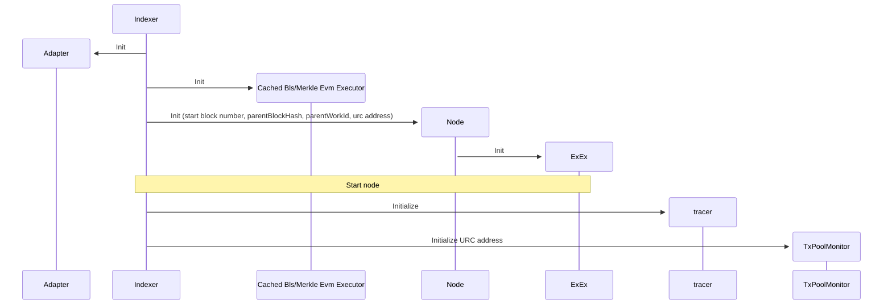
```mermaid
sequenceDiagram
    create participant Adapter
    Indexer->>+Adapter: Init
    create participant evm as Cached Bls/Merkle Evm Executor
    Indexer->>+evm: Init

    create participant Node
    Indexer->>+Node: Init (start block number, parentBlockHash, parentWorkId, urc address)

    create participant ExEx
    Node->>+ExEx: Init 
    Note over Indexer,ExEx: Start node

    create participant tracer
    Indexer->>+tracer: Initialize

    create participant TxPoolMonitor
    Indexer->>+TxPoolMonitor: Initialize URC address

```
# Indexer Db Initialization 

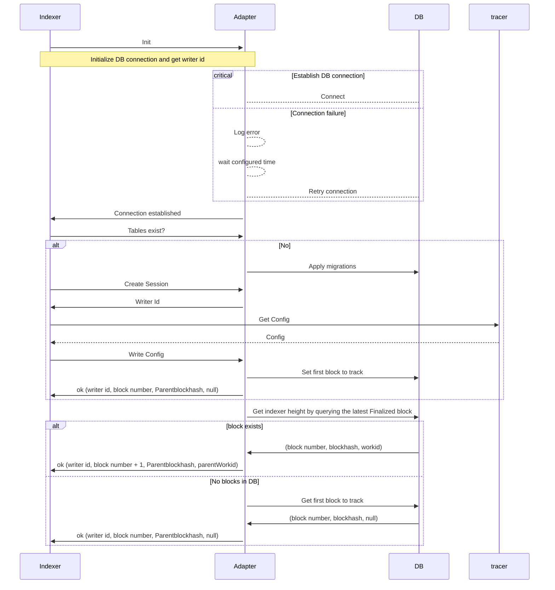
```mermaid
sequenceDiagram
    Indexer->>+Adapter: Init
    Note over Indexer,Adapter: Initialize DB connection and get writer id
    critical Establish DB connection
       Adapter-->DB: Connect
    option Connection failure
        Adapter-->Adapter: Log error
        Adapter-->Adapter: wait configured time
        Adapter-->DB: Retry connection
    end
    Adapter->>Indexer: Connection established
    
    Indexer->>Adapter: Tables exist?
    alt No
        Adapter->>DB: Apply migrations
        Indexer->>Adapter: Create Session
        Adapter->>Indexer: Writer Id
        Indexer->>tracer: Get Config
        tracer-->>Indexer: Config
        Indexer->>Adapter: Write Config
        Adapter->>DB: Set first block to track
        Adapter->>Indexer: ok (writer id, block number, Parentblockhash, null)
    end

    Adapter->>DB: Get indexer height by querying the latest Finalized block

    alt  block exists
        DB->>Adapter: (block number, blockhash, workid)
        Adapter->>Indexer: ok (writer id, block number + 1, Parentblockhash, parentWorkid)
    else No blocks in DB
        Adapter->>DB: Get  first block to track
        DB->>Adapter: (block number, blockhash, null)
        Adapter->>Indexer: ok (writer id, block number, Parentblockhash, null)
    end

```

# Indexer Events

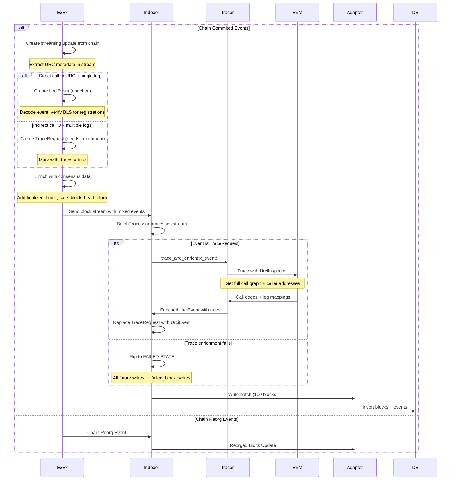
```mermaid
sequenceDiagram
    alt Chain Commited Events
      ExEx->>ExEx: Create streaming update from chain
      Note over ExEx: Extract URC metadata in stream
      alt Direct call to URC + single log
          ExEx->>ExEx: Create UrciEvent (enriched)
          Note over ExEx: Decode event, verify BLS for registrations
      else Indirect call OR multiple logs
          ExEx->>ExEx: Create TraceRequest (needs enrichment)
          Note over ExEx: Mark with .tracer = true
      end
      ExEx->>ExEx: Enrich with consensus data
      Note over ExEx: Add finalized_block, safe_block, head_block
      ExEx->>Indexer: Send block stream with mixed events

      Indexer->>Indexer: BatchProcessor processes stream
      alt Event is TraceRequest
          Indexer->>tracer: trace_and_enrich(tx_event)
          tracer->>EVM: Trace with UrciInspector
          Note over tracer,EVM: Get full call graph + caller addresses
          EVM->>tracer: Call edges + log mappings
          tracer->>Indexer: Enriched UrciEvent with trace
          Indexer->>Indexer: Replace TraceRequest with UrciEvent
      else Trace enrichment fails
          Indexer->>Indexer: Flip to FAILED STATE
          Note over Indexer: All future writes → failed_block_writes
      end

      Indexer->>Adapter: Write batch (100 blocks)
      Adapter->>DB: Insert blocks + events
    else Chain Reorg Events
        ExEx->>Indexer: Chain Reorg Event
        Indexer->>Adapter: Reorged Block Update
    end
```
## Indexer Operator Registration Event

Registration events are enriched during stream creation (for direct calls) or BatchProcessor trace enrichment (for indirect calls).
By the time the event reaches db_adapter, it already contains:
- Owner address (from call graph)
- BLS validation results (signature, pubkey, merkle proof)
- Registration data

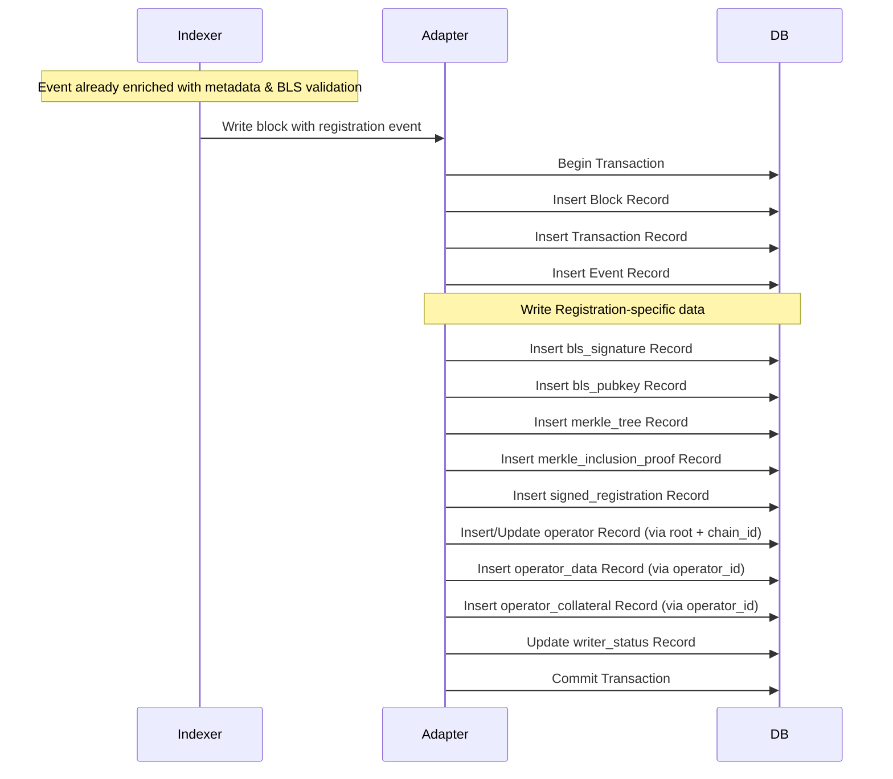
```mermaid
sequenceDiagram
      Note over Indexer: Event already enriched with metadata & BLS validation
      Indexer->>Adapter: Write block with registration event
      Adapter->>DB: Begin Transaction
      Adapter->>DB: Insert Block Record
      Adapter->>DB: Insert Transaction Record
      Adapter->>DB: Insert Event Record

      Note over Adapter,DB: Write Registration-specific data
      Adapter->>DB: Insert bls_signature Record
      Adapter->>DB: Insert bls_pubkey Record
      Adapter->>DB: Insert merkle_tree Record
      Adapter->>DB: Insert merkle_inclusion_proof Record
      Adapter->>DB: Insert signed_registration Record
      Adapter->>DB: Insert/Update operator Record (via root + chain_id)
      Adapter->>DB: Insert operator_data Record (via operator_id)
      Adapter->>DB: Insert operator_collateral Record (via operator_id)
      Adapter->>DB: Update writer_status Record
      Adapter->>DB: Commit Transaction

```

## Indexer Operator Unregistered Event

Unregistration events are enriched during stream creation (for direct calls) or BatchProcessor trace enrichment (for indirect calls).
By the time the event reaches db_adapter, it already contains all necessary metadata.

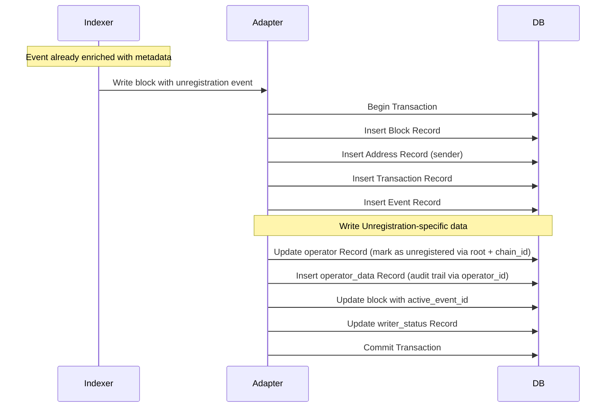
```mermaid
sequenceDiagram
      Note over Indexer: Event already enriched with metadata
      Indexer->>Adapter: Write block with unregistration event
      Adapter->>DB: Begin Transaction
      Adapter->>DB: Insert Block Record
      Adapter->>DB: Insert Address Record (sender)
      Adapter->>DB: Insert Transaction Record
      Adapter->>DB: Insert Event Record

      Note over Adapter,DB: Write Unregistration-specific data
      Adapter->>DB: Update operator Record (mark as unregistered via root + chain_id)
      Adapter->>DB: Insert operator_data Record (audit trail via operator_id)
      Adapter->>DB: Update block with active_event_id
      Adapter->>DB: Update writer_status Record
      Adapter->>DB: Commit Transaction

```

## Indexer Operator Opt-In Event

Opt-in events are enriched during stream creation (for direct calls) or BatchProcessor trace enrichment (for indirect calls).
By the time the event reaches db_adapter, it already contains: slasher address, committer address, registration root.

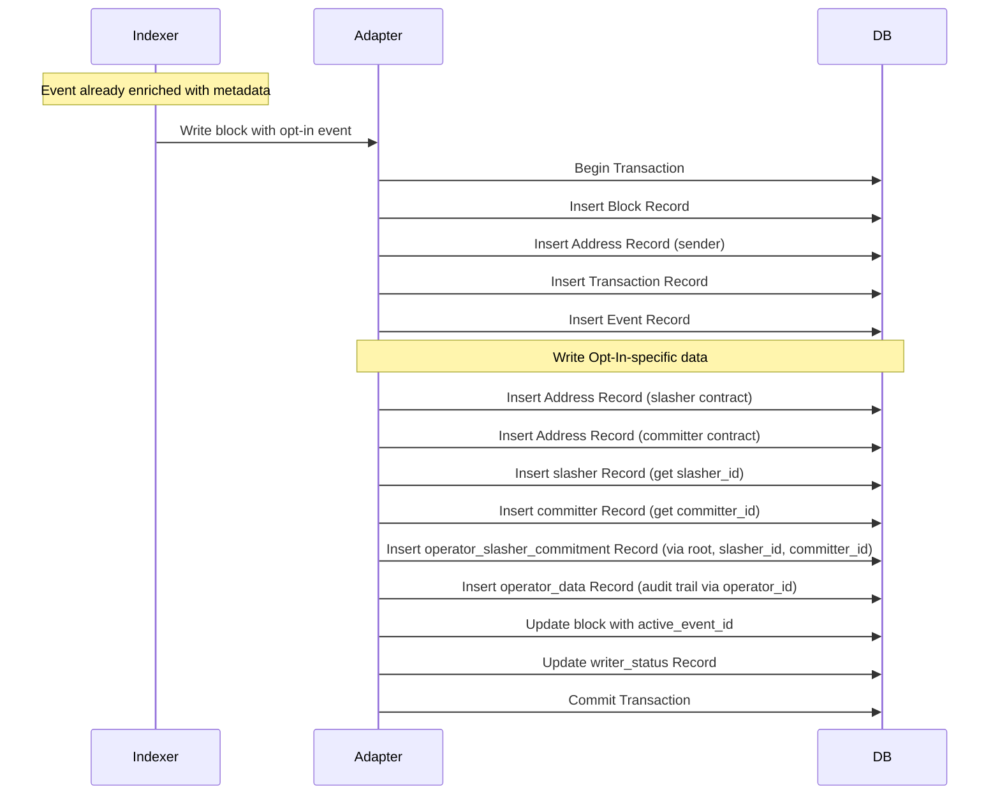
```mermaid
sequenceDiagram
      Note over Indexer: Event already enriched with metadata
      Indexer->>Adapter: Write block with opt-in event
      Adapter->>DB: Begin Transaction
      Adapter->>DB: Insert Block Record
      Adapter->>DB: Insert Address Record (sender)
      Adapter->>DB: Insert Transaction Record
      Adapter->>DB: Insert Event Record

      Note over Adapter,DB: Write Opt-In-specific data
      Adapter->>DB: Insert Address Record (slasher contract)
      Adapter->>DB: Insert Address Record (committer contract)
      Adapter->>DB: Insert slasher Record (get slasher_id)
      Adapter->>DB: Insert committer Record (get committer_id)
      Adapter->>DB: Insert operator_slasher_commitment Record (via root, slasher_id, committer_id)
      Adapter->>DB: Insert operator_data Record (audit trail via operator_id)
      Adapter->>DB: Update block with active_event_id
      Adapter->>DB: Update writer_status Record
      Adapter->>DB: Commit Transaction

```
## Indexer Operator Opt-Out Event

Opt-out events are enriched during stream creation (for direct calls) or BatchProcessor trace enrichment (for indirect calls).
By the time the event reaches db_adapter, it already contains: slasher address, registration root.

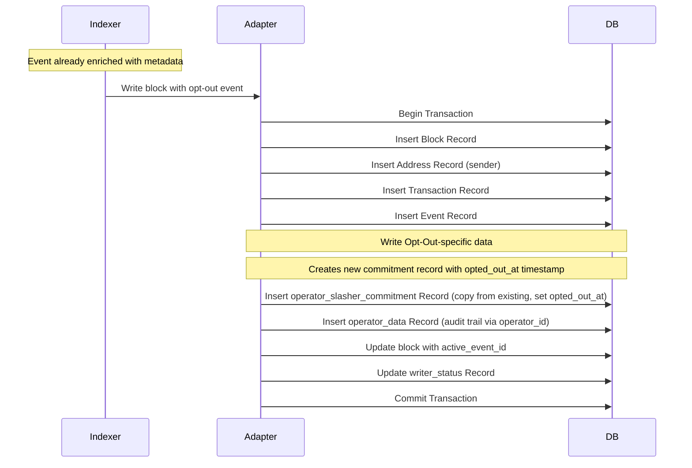
```mermaid
sequenceDiagram
      Note over Indexer: Event already enriched with metadata
      Indexer->>Adapter: Write block with opt-out event
      Adapter->>DB: Begin Transaction
      Adapter->>DB: Insert Block Record
      Adapter->>DB: Insert Address Record (sender)
      Adapter->>DB: Insert Transaction Record
      Adapter->>DB: Insert Event Record

      Note over Adapter,DB: Write Opt-Out-specific data
      Note over Adapter,DB: Creates new commitment record with opted_out_at timestamp
      Adapter->>DB: Insert operator_slasher_commitment Record (copy from existing, set opted_out_at)
      Adapter->>DB: Insert operator_data Record (audit trail via operator_id)
      Adapter->>DB: Update block with active_event_id
      Adapter->>DB: Update writer_status Record
      Adapter->>DB: Commit Transaction

```

## Indexer Operator Collateral Events

Collateral events (CollateralAdded, CollateralClaimed) are enriched during stream creation (for direct calls) or BatchProcessor trace enrichment (for indirect calls).
By the time the event reaches db_adapter, it already contains: registration root, collateral amount.

### CollateralAdded Flow
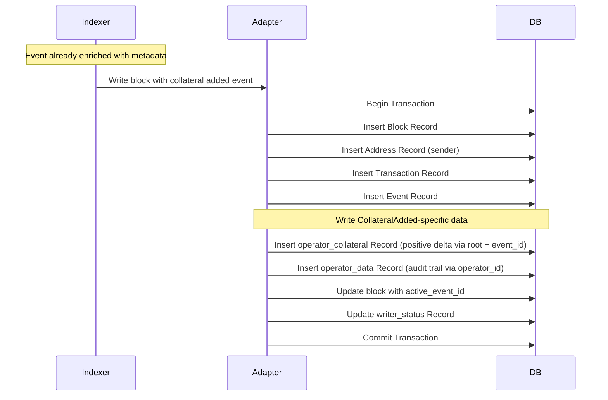
```mermaid
sequenceDiagram
      Note over Indexer: Event already enriched with metadata
      Indexer->>Adapter: Write block with collateral added event
      Adapter->>DB: Begin Transaction
      Adapter->>DB: Insert Block Record
      Adapter->>DB: Insert Address Record (sender)
      Adapter->>DB: Insert Transaction Record
      Adapter->>DB: Insert Event Record

      Note over Adapter,DB: Write CollateralAdded-specific data
      Adapter->>DB: Insert operator_collateral Record (positive delta via root + event_id)
      Adapter->>DB: Insert operator_data Record (audit trail via operator_id)
      Adapter->>DB: Update block with active_event_id
      Adapter->>DB: Update writer_status Record
      Adapter->>DB: Commit Transaction

```

### CollateralClaimed Flow
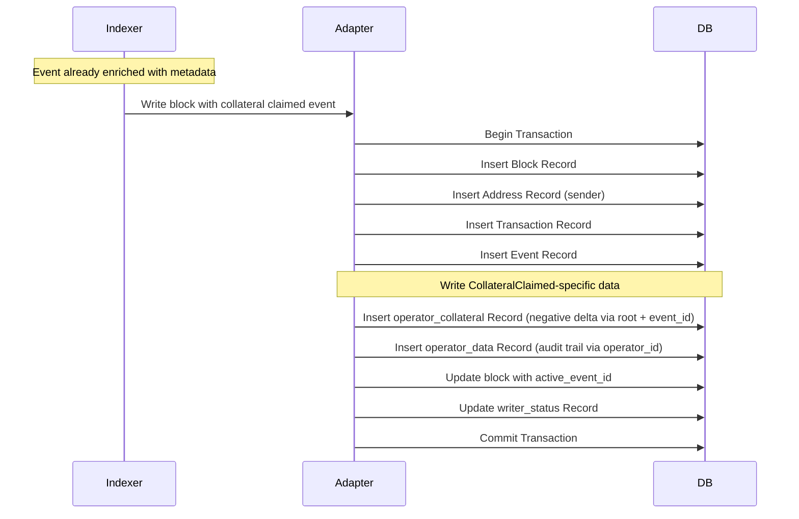
```mermaid
sequenceDiagram
      Note over Indexer: Event already enriched with metadata
      Indexer->>Adapter: Write block with collateral claimed event
      Adapter->>DB: Begin Transaction
      Adapter->>DB: Insert Block Record
      Adapter->>DB: Insert Address Record (sender)
      Adapter->>DB: Insert Transaction Record
      Adapter->>DB: Insert Event Record

      Note over Adapter,DB: Write CollateralClaimed-specific data
      Adapter->>DB: Insert operator_collateral Record (negative delta via root + event_id)
      Adapter->>DB: Insert operator_data Record (audit trail via operator_id)
      Adapter->>DB: Update block with active_event_id
      Adapter->>DB: Update writer_status Record
      Adapter->>DB: Commit Transaction

```

## Indexer Operator Slashed Events

Slashing events are enriched during stream creation (for direct calls) or BatchProcessor trace enrichment (for indirect calls).
By the time the event reaches db_adapter, it already contains all slash-type-specific proof data extracted from call data.

There are 4 types of slashing, each with different database writes:
1. **SlashRegistration (Fraud)**: 
2. **Commitment (off-chain delegation)**
3. **Commitment-2 **
4. **Equivocation**

### Common Slashing Flow (all types)
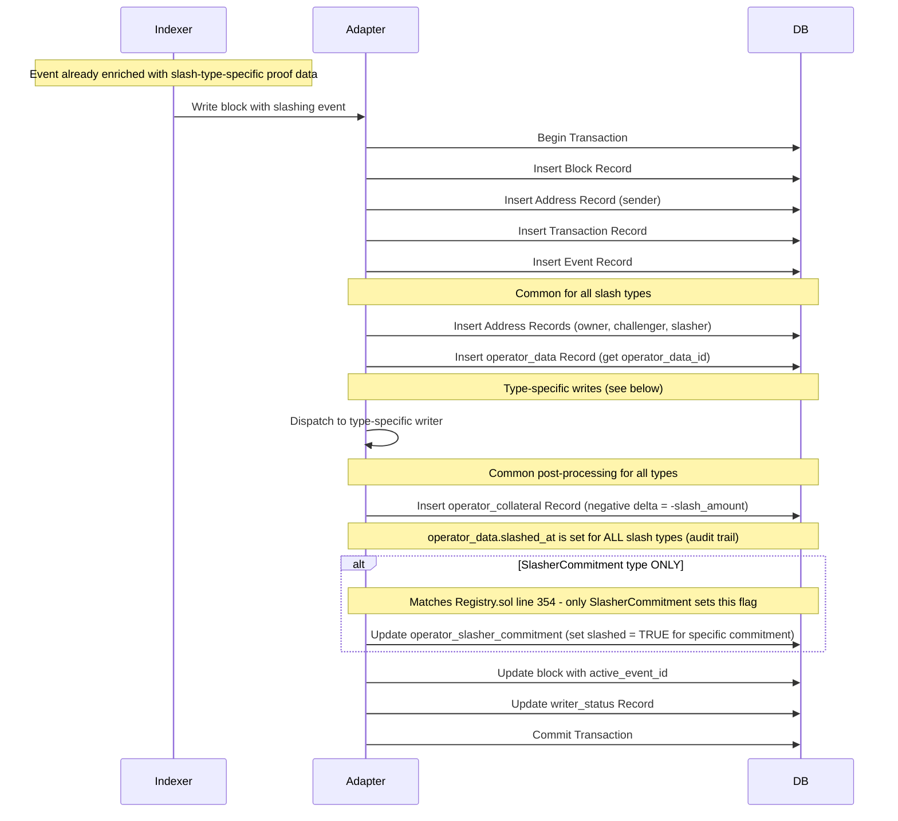
```mermaid
sequenceDiagram
      Note over Indexer: Event already enriched with slash-type-specific proof data
      Indexer->>Adapter: Write block with slashing event
      Adapter->>DB: Begin Transaction
      Adapter->>DB: Insert Block Record
      Adapter->>DB: Insert Address Record (sender)
      Adapter->>DB: Insert Transaction Record
      Adapter->>DB: Insert Event Record

      Note over Adapter,DB: Common for all slash types
      Adapter->>DB: Insert Address Records (owner, challenger, slasher)
      Adapter->>DB: Insert operator_data Record (get operator_data_id)

      Note over Adapter,DB: Type-specific writes (see below)
      Adapter->>Adapter: Dispatch to type-specific writer

      Note over Adapter,DB: Common post-processing for all types
      Adapter->>DB: Insert operator_collateral Record (negative delta = -slash_amount)
      Note over Adapter,DB: operator_data.slashed_at is set for ALL slash types (audit trail)
      alt SlasherCommitment type ONLY
          Note over Adapter,DB: Matches Registry.sol line 354 - only SlasherCommitment sets this flag
          Adapter->>DB: Update operator_slasher_commitment (set slashed = TRUE for specific commitment)
      end
      Adapter->>DB: Update block with active_event_id
      Adapter->>DB: Update writer_status Record
      Adapter->>DB: Commit Transaction
```

### SlashRegistration (Fraud) Specific Writes
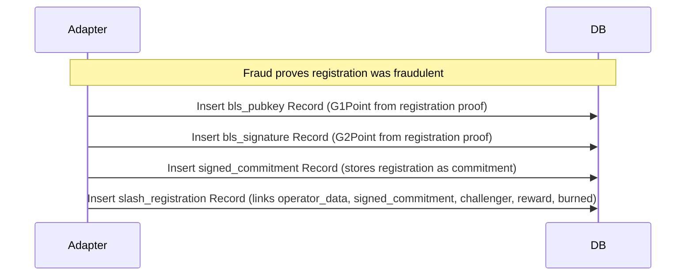
```mermaid
sequenceDiagram
      Note over Adapter,DB: Fraud proves registration was fraudulent
      Adapter->>DB: Insert bls_pubkey Record (G1Point from registration proof)
      Adapter->>DB: Insert bls_signature Record (G2Point from registration proof)
      Adapter->>DB: Insert signed_commitment Record (stores registration as commitment)
      Adapter->>DB: Insert slash_registration Record (links operator_data, signed_commitment, challenger, reward, burned)
```

### Commitment (with Delegation) Specific Writes
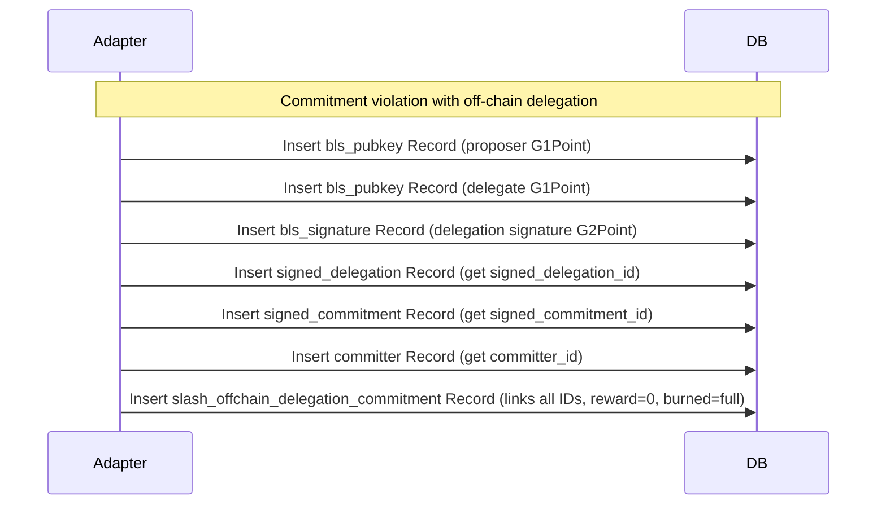
```mermaid
sequenceDiagram
      Note over Adapter,DB: Commitment violation with off-chain delegation
      Adapter->>DB: Insert bls_pubkey Record (proposer G1Point)
      Adapter->>DB: Insert bls_pubkey Record (delegate G1Point)
      Adapter->>DB: Insert bls_signature Record (delegation signature G2Point)
      Adapter->>DB: Insert signed_delegation Record (get signed_delegation_id)
      Adapter->>DB: Insert signed_commitment Record (get signed_commitment_id)
      Adapter->>DB: Insert committer Record (get committer_id)
      Adapter->>DB: Insert slash_offchain_delegation_commitment Record (links all IDs, reward=0, burned=full)
```

### Commitment-2  Specific Writes
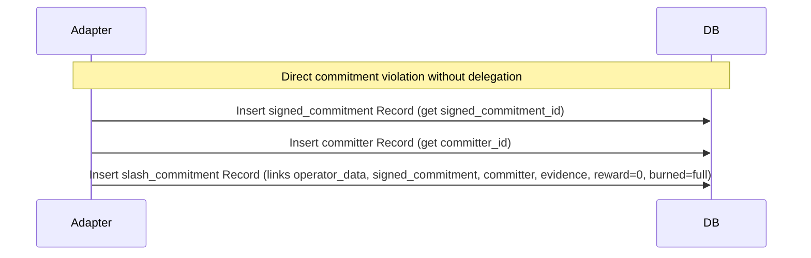
```mermaid
sequenceDiagram
      Note over Adapter,DB: Direct commitment violation without delegation
      Adapter->>DB: Insert signed_commitment Record (get signed_commitment_id)
      Adapter->>DB: Insert committer Record (get committer_id)
      Adapter->>DB: Insert slash_commitment Record (links operator_data, signed_commitment, committer, evidence, reward=0, burned=full)
```

### Equivocation Specific Writes
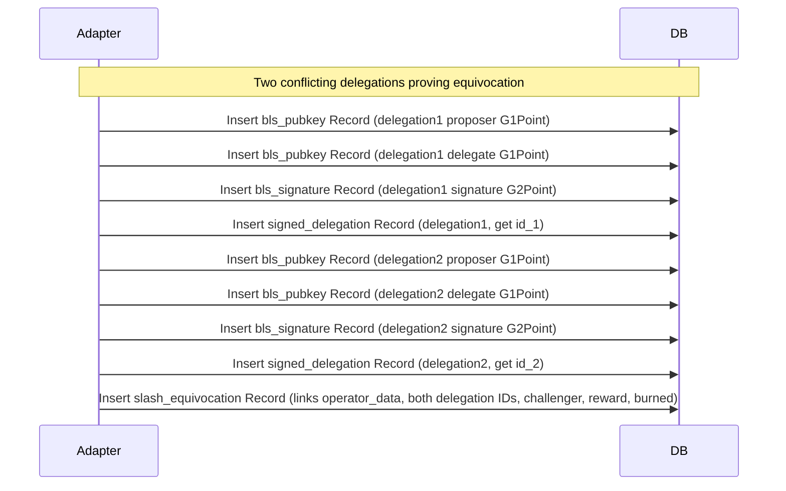
```mermaid
sequenceDiagram
      Note over Adapter,DB: Two conflicting delegations proving equivocation
      Adapter->>DB: Insert bls_pubkey Record (delegation1 proposer G1Point)
      Adapter->>DB: Insert bls_pubkey Record (delegation1 delegate G1Point)
      Adapter->>DB: Insert bls_signature Record (delegation1 signature G2Point)
      Adapter->>DB: Insert signed_delegation Record (delegation1, get id_1)

      Adapter->>DB: Insert bls_pubkey Record (delegation2 proposer G1Point)
      Adapter->>DB: Insert bls_pubkey Record (delegation2 delegate G1Point)
      Adapter->>DB: Insert bls_signature Record (delegation2 signature G2Point)
      Adapter->>DB: Insert signed_delegation Record (delegation2, get id_2)

      Adapter->>DB: Insert slash_equivocation Record (links operator_data, both delegation IDs, challenger, reward, burned)
```

# Indexer Block Update

This shows the complete atomic write flow for a single block with all its events.
All writes happen in a single database transaction.

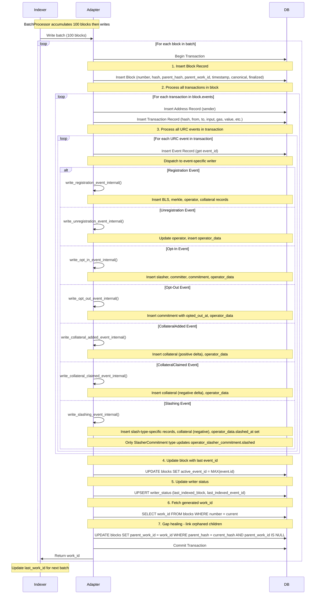
```mermaid
sequenceDiagram
      Note over Indexer,Adapter: BatchProcessor accumulates 100 blocks then writes

      Indexer->>Adapter: Write batch (100 blocks)

      loop For each block in batch
          Adapter->>DB: Begin Transaction

          Note over Adapter,DB: 1. Insert Block Record
          Adapter->>DB: Insert Block (number, hash, parent_hash, parent_work_id, timestamp, canonical, finalized)

          Note over Adapter,DB: 2. Process all transactions in block
          loop For each transaction in block.events
              Adapter->>DB: Insert Address Record (sender)
              Adapter->>DB: Insert Transaction Record (hash, from, to, input, gas, value, etc.)

              Note over Adapter,DB: 3. Process all URC events in transaction
              loop For each URC event in transaction
                  Adapter->>DB: Insert Event Record (get event_id)

                  Note over Adapter,DB: Dispatch to event-specific writer
                  alt Registration Event
                      Adapter->>Adapter: write_registration_event_internal()
                      Note over Adapter,DB: Insert BLS, merkle, operator, collateral records
                  else Unregistration Event
                      Adapter->>Adapter: write_unregistration_event_internal()
                      Note over Adapter,DB: Update operator, insert operator_data
                  else Opt-In Event
                      Adapter->>Adapter: write_opt_in_event_internal()
                      Note over Adapter,DB: Insert slasher, committer, commitment, operator_data
                  else Opt-Out Event
                      Adapter->>Adapter: write_opt_out_event_internal()
                      Note over Adapter,DB: Insert commitment with opted_out_at, operator_data
                  else CollateralAdded Event
                      Adapter->>Adapter: write_collateral_added_event_internal()
                      Note over Adapter,DB: Insert collateral (positive delta), operator_data
                  else CollateralClaimed Event
                      Adapter->>Adapter: write_collateral_claimed_event_internal()
                      Note over Adapter,DB: Insert collateral (negative delta), operator_data
                  else Slashing Event
                      Adapter->>Adapter: write_slashing_event_internal()
                      Note over Adapter,DB: Insert slash-type-specific records, collateral (negative), operator_data.slashed_at set
                      Note over Adapter,DB: Only SlasherCommitment type updates operator_slasher_commitment.slashed
                  end
              end
          end

          Note over Adapter,DB: 4. Update block with last event_id
          Adapter->>DB: UPDATE blocks SET active_event_id = MAX(event.id)

          Note over Adapter,DB: 5. Update writer status
          Adapter->>DB: UPSERT writer_status (last_indexed_block, last_indexed_event_id)

          Note over Adapter,DB: 6. Fetch generated work_id
          Adapter->>DB: SELECT work_id FROM blocks WHERE number = current

          Note over Adapter,DB: 7. Gap healing - link orphaned children
          Adapter->>DB: UPDATE blocks SET parent_work_id = work_id WHERE parent_hash = current_hash AND parent_work_id IS NULL

          Adapter->>DB: Commit Transaction
          Adapter->>Indexer: Return work_id
      end

      Note over Indexer: Update last_work_id for next batch
```

# TxPool Monitor 

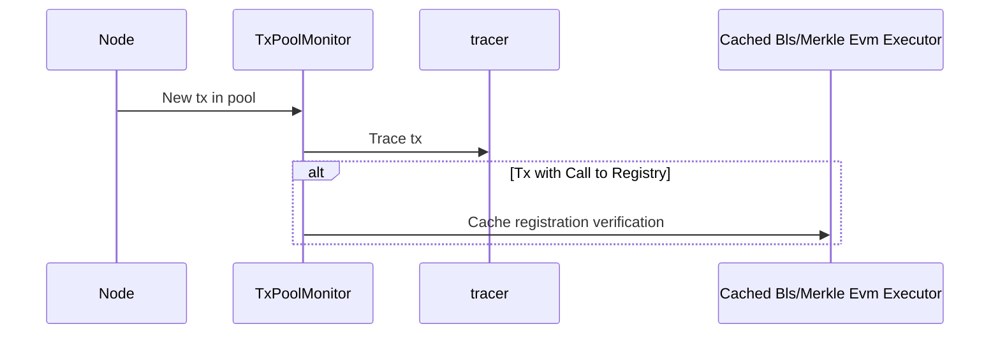
```mermaid
sequenceDiagram
    Node->>TxPoolMonitor: New tx in pool
    TxPoolMonitor->>tracer: Trace tx
    create participant evm as Cached Bls/Merkle Evm Executor
    alt Tx with Call to Registry
        TxPoolMonitor->>evm: Cache registration verification
    end
```

# Indexer Complete

This is the comprehensive end-to-end flow showing all components working together.

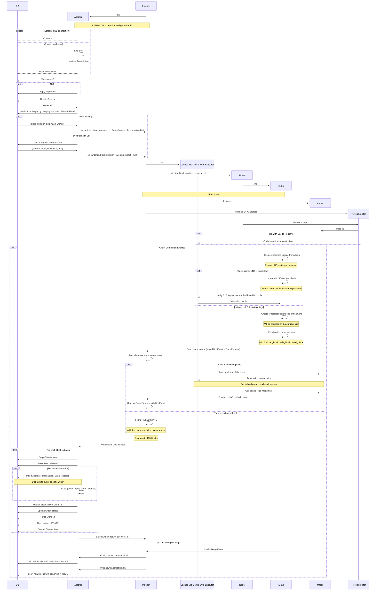
```mermaid
sequenceDiagram
    % Initialization

    create participant DB
    create participant Adapter

    % DB Initialization

    Indexer->>+Adapter: Init
    Note over Indexer,Adapter: Initialize DB connection and get writer id
    critical Establish DB connection
       Adapter-->DB: Connect
    option Connection failure
        Adapter-->Adapter: Log error
        Adapter-->Adapter: wait configured time
        Adapter-->DB: Retry connection
    end
    Adapter->>DB: Tables exist?
    alt No
        Adapter->>DB: Apply migrations
    end
    Adapter->>DB: Create Session
    DB->>Adapter: Writer Id
    Adapter->>DB: Get indexer height by querying the latest Finalized block
    alt  block exists
        DB->>Adapter: (block number, blockhash, workid)
        Adapter->>Indexer: ok (writer id, block number + 1, Parentblockhash, parentWorkid)
    else No blocks in DB
        Adapter->>DB: Get or Set first block to track
        DB->>Adapter: (block number, blockhash, null)
        Adapter->>Indexer: ok (writer id, block number, Parentblockhash, null)
    end

    create participant evm as Cached Bls/Merkle Evm Executor
    Indexer->>+evm: Init

    create participant Node
    Indexer->>+Node: Init (start block number, urc address)

    create participant ExEx
    Node->>+ExEx: Init
    Note over Indexer,ExEx: Start node

    create participant tracer
    Indexer->>+tracer: Initialize

    create participant TxPoolMonitor
    Indexer->>+TxPoolMonitor: Initialize URC address

    % TxPool Monitor

    Node->>TxPoolMonitor: New tx in pool
    TxPoolMonitor->>tracer: Trace tx
    alt Tx with Call to Registry
        TxPoolMonitor->>evm: Cache registration verification
    end

    % ExEx Event Stream Creation

    alt Chain Committed Events
      ExEx->>ExEx: Create streaming update from chain
      Note over ExEx: Extract URC metadata in stream

      alt Direct call to URC + single log
          ExEx->>ExEx: Create UrciEvent (enriched)
          Note over ExEx: Decode event, verify BLS for registrations
          ExEx->>evm: Verify BLS signatures and build merkle proofs
          evm->>ExEx: Validation results
      else Indirect call OR multiple logs
          ExEx->>ExEx: Create TraceRequest (needs enrichment)
          Note over ExEx: Will be enriched by BatchProcessor
      end

      ExEx->>ExEx: Enrich with consensus data
      Note over ExEx: Add finalized_block, safe_block, head_block
      ExEx->>Indexer: Send block stream (mixed UrciEvent + TraceRequest)

      % BatchProcessor Trace Enrichment

      Indexer->>Indexer: BatchProcessor processes stream
      alt Event is TraceRequest
          Indexer->>tracer: trace_and_enrich(tx_event)
          tracer->>evm: Trace with UrciInspector
          Note over tracer,evm: Get full call graph + caller addresses
          evm->>tracer: Call edges + log mappings
          tracer->>Indexer: Enriched UrciEvent with trace
          Indexer->>Indexer: Replace TraceRequest with UrciEvent
      else Trace enrichment fails
          Indexer->>Indexer: Flip to FAILED STATE
          Note over Indexer: All future writes → failed_block_writes
      end

      % Batch Write (100 blocks)

      Note over Indexer: Accumulate 100 blocks
      Indexer->>Adapter: Write batch (100 blocks)

      loop For each block in batch
          Adapter->>DB: Begin Transaction
          Adapter->>DB: Insert Block Record
          loop For each transaction
              Adapter->>DB: Insert Address, Transaction, Event Records
              Note over Adapter,DB: Dispatch to event-specific writer
              Adapter->>Adapter: write_{event_type}_event_internal()
          end
          Adapter->>DB: Update block active_event_id
          Adapter->>DB: Update writer_status
          Adapter->>DB: Fetch work_id
          Adapter->>DB: Gap healing UPDATE
          Adapter->>DB: Commit Transaction
      end

      Adapter->>Indexer: Batch written, return last work_id

    else Chain Reorg Events
        ExEx->>Indexer: Chain Reorg Event
        Indexer->>Adapter: Mark old blocks non-canonical
        Adapter->>DB: UPDATE blocks SET canonical = FALSE
        Indexer->>Adapter: Write new canonical chain
        Adapter->>DB: Insert new blocks with canonical = TRUE
    end

```

